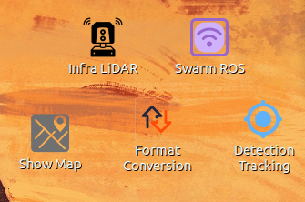
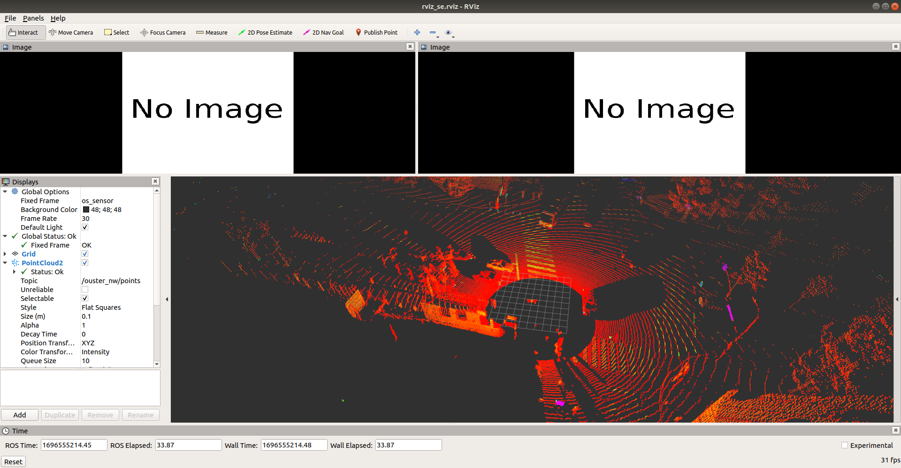
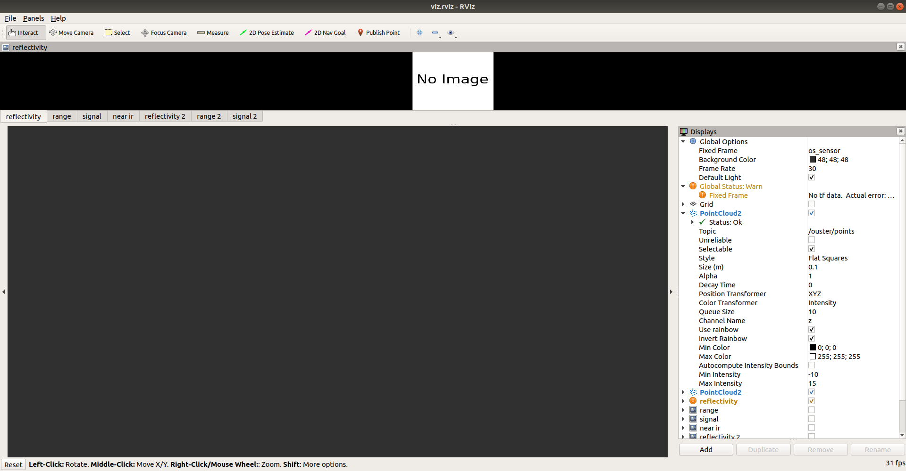
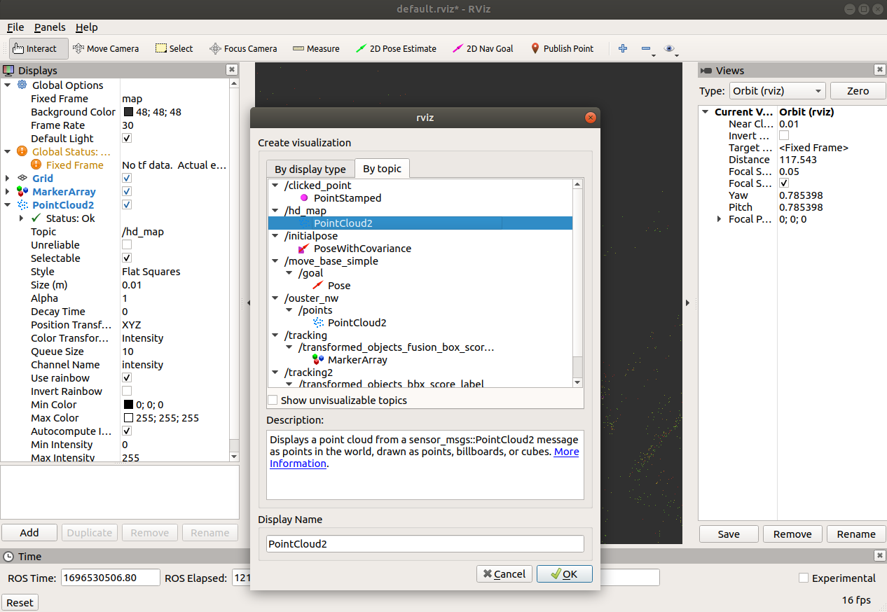
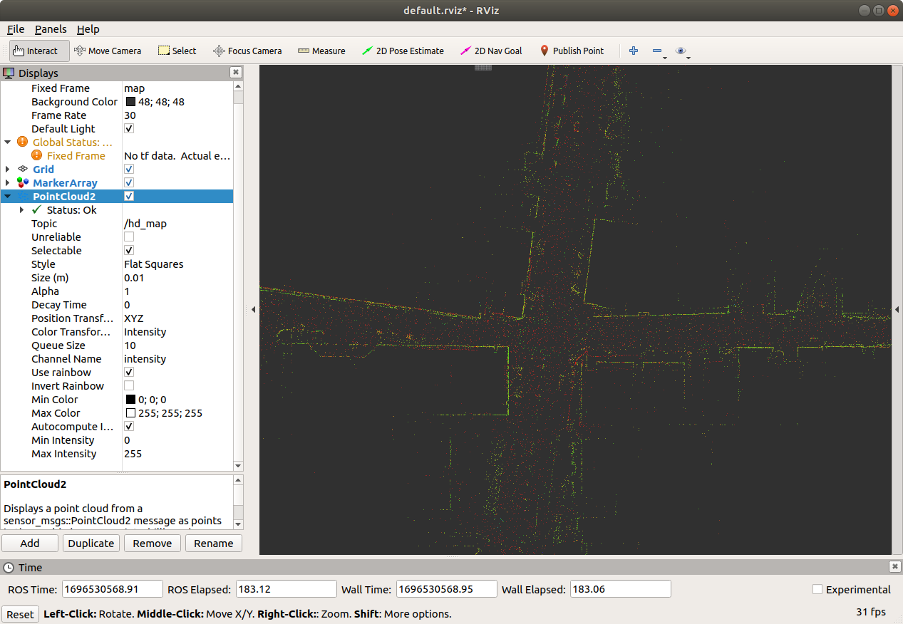

# Instruction

## 1 Infra

### 1.1 Workspace

In `bashrc`, there are several workspace in the laptop that needs use:

Open it using `gedit ~/.bashrc`:

```
source /home/zhaoliang/zzl/zhz03_github/Cooperfuse_framework/swarm_ros_bridge_ws/devel/setup.bash --extend

source /home/zhaoliang/zzl/zhz03_github/smart_intersection_infra/infra_hardware_ws/devel/setup.bash --extend

source /home/zhaoliang/zzl/zhz03_github/Cooperfuse_framework/format_conversion_git_ws/devel/setup.bash --extend

source /home/zhaoliang/zzl/zhz03_github/Cooperfuse_framework/tracking_git_ws/devel/setup.bash --extend
```

### 1.2 Icons

There are five icons:



### 1.3 Infra LiDAR

- position: 

  ```
  /home/zhaoliang/zzl/zhz03_github/smart_intersection_infra/infra_hardware_ws/src/infra_launch/launch/launch_nw.launch
  ```

- There will be two RVIZ windows pop up as shown in the follow:

  

  You need to close the second pop-up window since it takes some memory:

  

- What needs to be checked:

  - Change the system time back to 1 hour, if current time is `13:50`, then manually change it to `12:50`

  - Check the current GPS time:

    ```
    rostopic echo /ouster_nw/points/header
    ```

  - You should see the following: 

  - Go to: 

    ```
    /home/zhaoliang/zzl/zhz03_github/smart_intersection_infra/python_code
    ```
  
  - And then type:

    ```shell
    python convert_time.py xxxx
    ```
  
    You should see the following:
  
    

### 1.4 Show Map 

- position: 

  ```
  /home/zhaoliang/zzl/zhz03_github/Cooperfuse_framework/format_conversion_git_ws/src/pcl_pkgs/pcd_pub_ros/launch/launch_1pcd.launch
  ```

  Need to change the following map path if you are on a new laptop:

  ```xml
  <arg name="pcd_file1" default="/home/zhaoliang/zzl/zhz03_github/hdl_localization_ws/src/hdl_localization/data/ucla_merged.pcd" />
  ```

- Close the terminal after you see the map is in the RVIZ.

  - Open a new terminal and add `/hd_map` topic

    

- Here is what you will look like:

  

### 1.5 Format Conversion

- position:

  ```
  
  ```

- What needs to be check:

  - `rostopic echo /os_header`

### 1.6 Detection Tracking

- position:

  ```
  /home/zhaoliang/zzl/zhz03_github/Cooperfuse_framework/tracking_git_ws/src/data_project/launch/new_detection_tracking_2.launch
  ```

### 1.7 Swarm ROS

- position:

  ```
  /home/zhaoliang/zzl/zhz03_github/Cooperfuse_framework/swarm_ros_bridge_git_ws/src/swarm_ros_bridge/launch/agent2_test.launch
  ```

- Config file:

  ```
  /home/zhaoliang/zzl/zhz03_github/Cooperfuse_framework/swarm_ros_bridge_git_ws/src/swarm_ros_bridge/config/ros_topics_2.yaml
  ```

  ```yaml
  IP:
    self: '*'   # '*' stands for all self IPs
    robot3: 192.168.3.8
    test_local: 127.0.0.1 # just for local machine test
  
  ####### Send these ROS messages to remote robots #######
  ## if no send_topics needed, comment all these out
  send_topics:
  - topic_name: /tracking2/transformed_objects_bbx_score_label # the received messages will be published in this topic
    msg_type: visualization_msgs/MarkerArray # ROS message type (rosmsg style)
    srcIP: self # self IP 
    max_freq: 10 # max sending frequency (Hz) int
    srcPort: 3001 # message source port
  - topic_name: /os_header # send the messages of this ROS topic
    msg_type: std_msgs/Header # ROS message type (rosmsg style)
    max_freq: 10 # max sending frequency (Hz) int
    srcIP: self # self IP
    srcPort: 3002 # ports of send_topics should be different
  
  ####### receive these ROS messages from remote robots #######
  ## if no recv_topics needed, comment all these out
  recv_topics:
  - topic_name: /tracking/transformed_objects_fusion_box_score_label  # send the messages of this ROS topic
    msg_type: visualization_msgs/MarkerArray # ROS message type (rosmsg style)
    max_freq: 10 # max sending frequency (Hz) int
    srcIP: robot3 # message source IPname
    srcPort: 3001 # ports of send_topics should be different
  - topic_name: /rs_header # send the messages of this ROS topic
    msg_type: std_msgs/Header # ROS message type (rosmsg style)
    max_freq: 10 # max sending frequency (Hz) int
    srcIP: robot3 # message source IPname
    srcPort: 3002 # ports of send_topics should be different
  ```

  After connect with ORBI04, check the ip_address (for example: `192.168.3.x`) using following command: 

  ```
  ifconfig
  ```

  Change the following in the config file to:

  ```
  robot3: 192.168.3.x
  ```

- What needs to be checked:

  - check the hz of `rs_header`

    ```
    rostopic hz /rs_header
    ```

    

