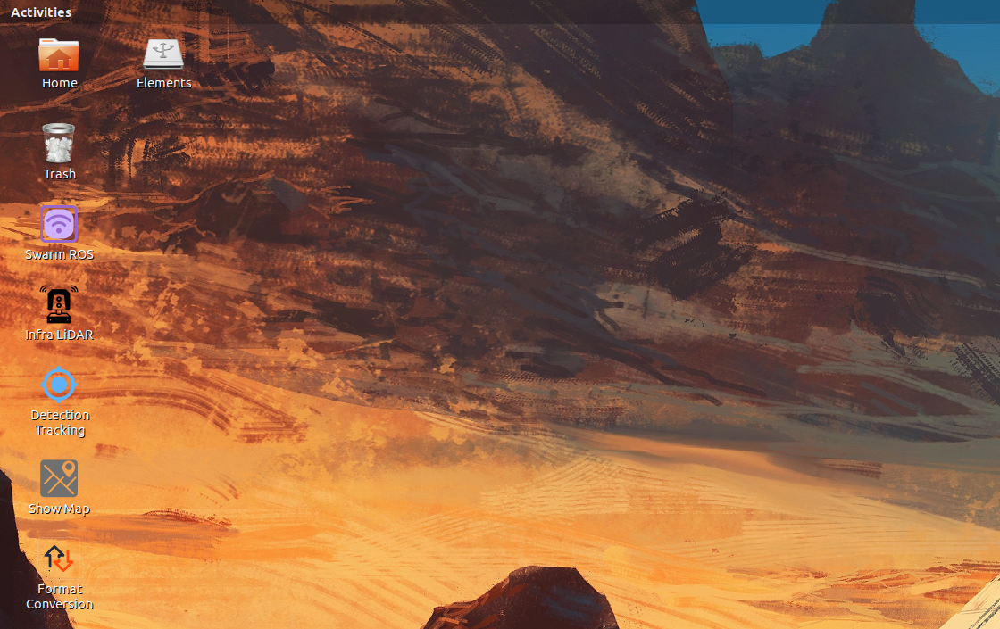

# Fast_ros_launch
Sometimes, we have issues with launching lots of ros node in different workspace. How can we just launch these ros node as like simply clicking the icons on the desktop. As shown in the pictures below, like `Swarm ROS`, `Infra LiDAR`, `Detection Tracking`, `Show Map` , `Format Conversion`  , you can click on these icons and then easily launch the corresponding ROS node.



This an example repo to show how to launch ros in a faster way.

## Step by Step process

### Step 1: Add ROS environment to bashrc

Open bashrc and add ros environment to it:

```
gedit ~/.bashrc
# add your ROS workspace environment to bashrc 
# for example
source /path/to/devel/setup.bash --extend
```

- `source /path/to/devel/setup.bash`: This is typically the setup script used for ROS workspaces. By adding this line to `~/.bashrc`, you can automatically set up the ROS environment every time a new terminal is launched. This means you don't need to manually enter the `source` command to set up the ROS environment; it will be executed automatically at the beginning of each terminal session.

- `--extend`: This is an optional parameter that instructs ROS to extend the existing environment rather than overwrite it. This is useful when you want to call the `source` command multiple times within one terminal session. It allows you to add the new ROS workspace path to the existing environment without overwriting the existing settings. This is particularly useful when working with multiple ROS workspaces.

### Step 2: Download svg files

You need to download some intuitive `svg` files as the icons of your applications(ros launch node).

In our repo, we provide some in the `icons` directory.

You can download it from: 

- English svg website: [https://www.svgrepo.com/](https://www.svgrepo.com/)
- Chinese svg website: [https://www.iconfont.cn/?spm=a313x.search_index.i3.d4d0a486a.3ffd3a81ywaJ6q](https://www.iconfont.cn/?spm=a313x.search_index.i3.d4d0a486a.3ffd3a81ywaJ6q)

### Step 3: Edit desktop file

On your Ubuntu desktop, create and edit desktop file:

```
cd ~/Desktop
vim my_launch.desktop
```

Here is an example, we have more example in the `desktop` directory:

```
[Desktop Entry]
Version=1.0
Type=Application
Terminal=true
Exec=bash -ci 'roslaunch pcd_pub_ros launch_1pcd.launch --screen'
Name=Show Map
Comment=Show Map
Icon=/home/zhaoliang/Documents/lincoln_car/icons/map2.svg
```

- **[Desktop Entry]:** This is the header section that marks the beginning of the desktop entry file.
- **Version=1.0:** This specifies the version of the Desktop Entry Specification that this file adheres to. In this case, it's version 1.0.
- **Type=Application:** This line indicates that the desktop entry represents an application.
- **Terminal=true:** This indicates that the application should be run in a terminal emulator when launched. Setting this to "true" means that the application's output will be visible in a terminal window.
- **Exec=bash -ci 'roslaunch pcd_pub_ros launch_1pcd.launch --screen':** This is the command that is executed when the desktop entry is launched. It runs a `bash` shell with the `-c` option, which allows you to run a command specified as an argument. In this case, it runs the `roslaunch` command to launch a ROS (Robot Operating System) launch file named `launch_1pcd.launch` with the `--screen` option. This command likely starts a ROS application related to displaying a map.
- **Name=Show Map:** This is the name of the desktop entry, which is displayed in the application menu or launcher. In this case, it's "Show Map."
- **Comment=Show Map:** This is a brief description or comment about the desktop entry. It provides additional information about what the application does.
- **Icon=/home/zhaoliang/Documents/lincoln_car/icons/map2.svg:** This specifies the path to an icon image file that represents the application. In this case, the icon is located at `/home/zhaoliang/Documents/lincoln_car/icons/map2.svg`. The specified image file will be used as the application's icon in the desktop environment's menu or launcher.

### Step 4: Give permission and trust launch

You need to give the executing access to the file as program:

```
cd ~/Desktop
sudo chmod 777 my_launch.desktop
```

Then for the first time to double click and launch this applications on the desktop, in the pop-up window, you need to click  `Trust and launch`.
