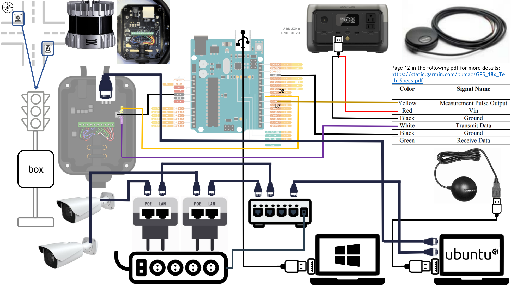
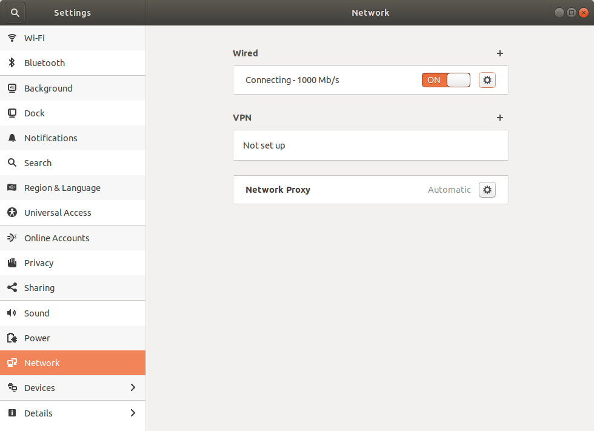
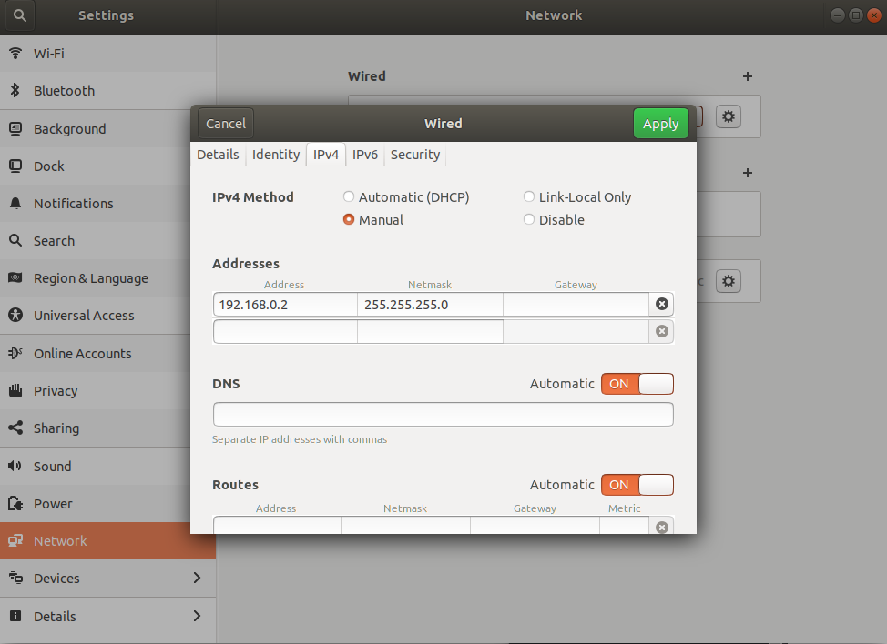
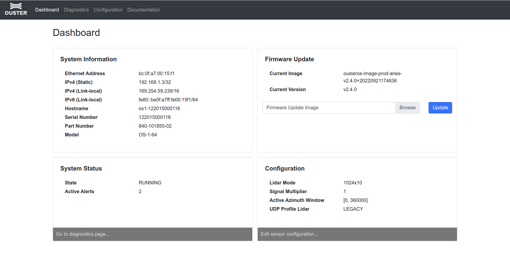
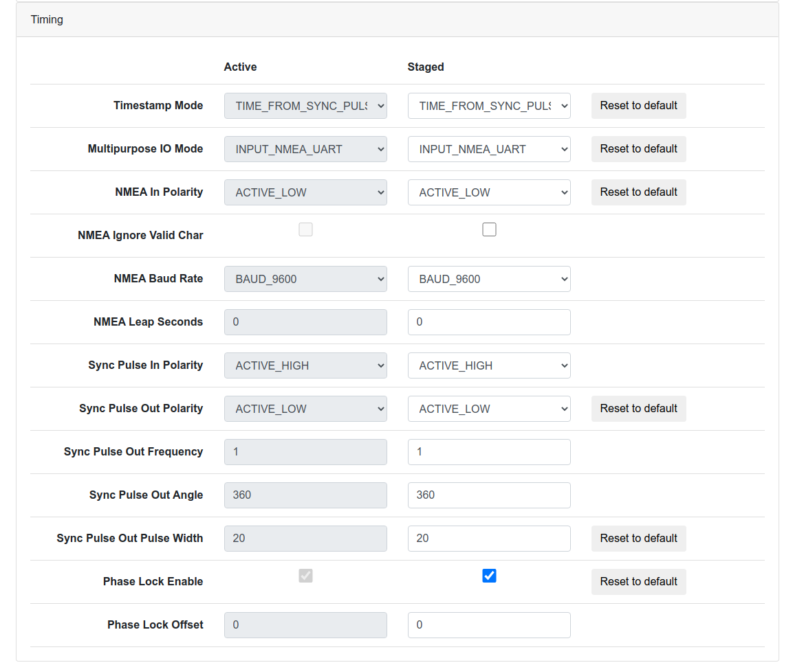

# smart_intersection_infra

## Introduction

This repo is for smart intersection infra hardware code.  

There are three hardware need to be setup and launch at the intersection:

- Ouster_lidar * 1 
- Camera * 2 
- [Garmin GPS](https://static.garmin.com/pumac/GPS_18x_Tech_Specs.pdf) * 1

## 1 System setup

### 1.1 Hardware setup

The hardware setup should be as follows:



Please follow the above image to connect all wires. 

### 1.2 Software setup

Navigate to: `/smart_intersection_infra/infra_hardware_ws`

The structure of the src is:

```
└── src
    ├── axis_camera
    ├── camera_info_manager_py
    ├── CMakeLists.txt -> /opt/ros/melodic/share/catkin/cmake/toplevel.cmake
    ├── infra_launch
    ├── ipcamera_driver
    ├── nmea_gps_driver
    ├── novatel_oem7_driver
    └── ouster-ros
```

You need to install corresponding dependencies for `ouster-ros`

After all the dependencies are installed, you can then compile it:

```
catkin_make
```

After that, you should be able to see `build` and `devel` in the current directory. 

## 2 Pre-check

You need to pre-check several things before running the ROS code.

### 2.1 Ouster lidar

Please make sure your wire connection setup is correct. After that, you can check the following things:

**Setup the wire connection:**

You need to turn on the Ubuntu wire connection as follows:



You need to set its ip_address to be: `192.168.1.x`, `x` could be any number between 4~255:



Go back to the previous page after you click `Apply`, turn off the wire connection switch and turn it on again to make sure your changes have effect.

**Web interface:**

In your website, enter `192.168.1.3`, you should see the web interface as follows and this means that your Lidar connection is correct.



Please check the web_config and make sure it's settings are correct as shown in the following picture:



**System info:** 

Please enter the command `GET 192.168.1.3/api/v1/time/sensor` into the terminal. And you should be able to see:

```
{"multipurpose_io": {"nmea": {"leap_seconds": 0, "diagnostics": {"decoding": {"utc_decoded_count": 14410, "not_valid_count": 0, "date_decoded_count": 14410, "last_read_message": "GPRMC,015251,A,3404.0153,N,11826.7191,W,000.0,000.0,270223,012.4,E*61"}, "io_checks": {"bit_count": 8497393, "bit_count_unfiltered": 8512825, "start_char_count": 25159, "char_count": 2698593}}, "baud_rate": "BAUD_9600", "ignore_valid_char": 0, "locked": 1, "polarity": "ACTIVE_LOW"}, "sync_pulse_out": {"polarity": "ACTIVE_HIGH", "frequency_hz": 1, "angle_deg": 360, "pulse_width_ms": 10}, "mode": "INPUT_NMEA_UART"}, "sync_pulse_in": {"polarity": "ACTIVE_HIGH", "diagnostics": {"count": 30920, "count_unfiltered": 704932, "last_period_nsec": 0}, "locked": 1}, "timestamp": {"time_options": {"ptp_1588": 1143485, "internal_osc": 1143477, "sync_pulse_in": 1677462633}, "mode": "TIME_FROM_SYNC_PULSE_IN", "time": 1677462634.3781691}}
```

You need to make sure both `locked` in `"multipurpose_io"` and `"sync_pulse_in"` should be `1`. Otherwise, it's problematic.

### 2.2 Camera web interface

**For southeast corner:**

In your website, enter `192.168.0.212` and `192.168.0.213`

**For northwest corner:**

In your website, enter `192.168.0.214` and `192.168.0.215`

## 3 Launch all

For GPS USB version, we need to change the usb to executable by:

```
ls /dev/ttyUSB*
sudo chmod 777 /dev/ttyUSB0
```

Path: `/smart_intersection_infra/infra_hardware_ws`

**For southeast corner:**

```
source devel/setup.bash
roslaunch infra_launch launch_se.launch 
```

**For northwest corner:**

```
source devel/setup.bash
roslaunch infra_launch launch_nw.launch 
```

You should be able to see the following RVIZ window:

## 4 Check the ros time

For ouster Lidar, we need to double check to see if 

Path: `/smart_intersection_infra/python_code`

```
python convert_time.py 1677891782
```

Replace the `1677891782` with your time stamp.

The output of the code should be:

```
1677891782
2023-03-03 17:03:02
```

## 5 Record data

Use the following code to record rosbag.

**For NW corner:**

```
rosbag record --split --duration=1m /axis214/camera_info /axis215/camera_info /axis215/image_raw/compressed /axis215/image_raw/compressed /ouster_nw/points /gps_nw/gps_time_30hz /gps_nw/gps_time_ori /gps_nw/gps_time_300hz  
```

**For SE corner:**

```
rosbag record --split --duration=1m /axis212/camera_info /axis213/camera_info /axis212/image_raw/compressed /axis213/image_raw/compressed /ouster_se/points /gps_se/gps_time_300hz /gps_se/gps_time_ori /gps_se/gps_time_30hz 
```

**During recording, what need to be checked:**

- Check `rosbag info xxx.bag` after one rosbag is finished recording:
  - Check the ros topic number and see if it's correct.
  - Check the topic frequency and see if it's correct.
- We also need to monitor the camera and Lidar running situations while running the code:
  - If there is any stuck.
  - If there is any image corrupted.
- We need to check `rostopic echo /ouster_nw/points/header ` or `rostopic echo /ouster_se/points/header` while Lidar is running. Need to make sure the header is running continuously. 
- We need to check `rostopic hz /image` to check if image is running at a correct frequency: 30 hz. 

**Special scenarios tags:**

Navigate to `./python_code/get_time_tag.py`

In order to run this code, you need to activate your virtual environment and install corresponding dependencies, for example:

```
pip install pygame
```

