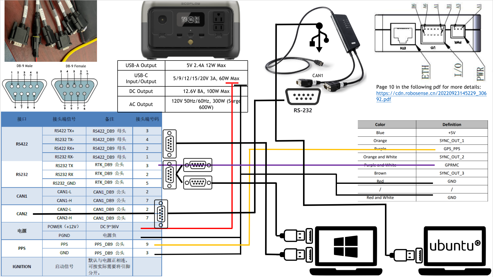
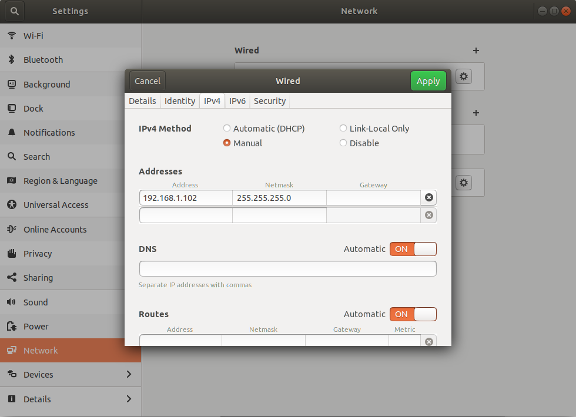
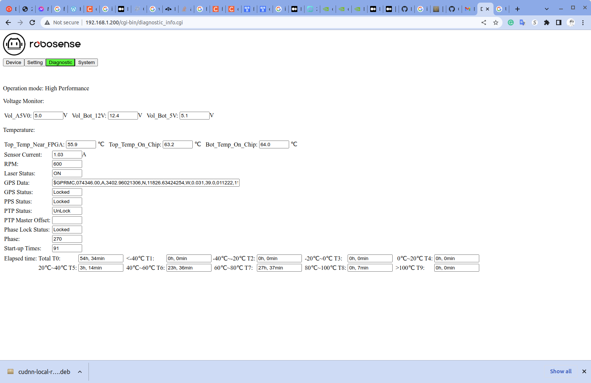

# smart_intersection_vehicle

## Introduction

This repo is for smart intersection vehicle hardware code.

There are three hardware need to be setup and launch on the vehicle.

- RSLidar * 1 
- Zed camera * 4 
- GPS Kvaster * 1

## 1 System setup

### 1.1 Hardware setup

The wire connection is shown below:



### 1.2 Software setup

- Conda is installed and install a virtual environment

  ```
  conda env create -f environment.yml
  ```

- Download the latest git 

  ```
  git clone https://github.com/zhz03/smart_intersection_vehicle.git
  ```

## 2 Pre-check 

You need to pre-check several things before running the ROS code.

### 2.1 RSLidar

Please make sure your wire connection setup is correct. After that, you can check the following things:

**Setup the wire connection:**


You need to set its ip_address to be: `192.168.1.102`:



Go back to the previous page after you click `Apply`, turn off the wire connection switch and turn it on again to make sure your changes have effect.

**Web interface:**

Please enter the `192.168.1.200` in your browser and you should be able to see something similar to the following:



If you see `GPS Data` has `$GPRMC` data and also the `GPS Status` and `PPS Status` are both `Locked `, then your Lidar setup is correct.

### 2.2 GPS status

Connect the 422 wire to your Windows laptop. And launch the GongJi software.

**Gongji software**

**RTK software**

## 3 Launch all 

Path: `/smart_intersection_vehicle/vehicle_hardware_ws`

**For vehicle 1:**

To launch rslidar: 

```
source devel/setup.bash
roslaunch vehicle_launch launch_v1_rslidar.launch
```

To launch all zed cameras:

```
source devel/setup.bash
roslaunch vehicle_launch launch_v1_zed_cam.launch
```

To launch gps:

```
conda activate calib_gui
source devel/setup.bash
roslaunch vehicle_launch launch_v1_gps.launch
```

**For vehicle 2:**

To launch rslidar: 

```
source devel/setup.bash
roslaunch vehicle_launch launch_v2_rslidar.launch
```

To launch all zed cameras:

```
source devel/setup.bash
roslaunch vehicle_launch launch_v2_zed_cam.launch
```

To launch gps:

```
conda activate calib_gui
source devel/setup.bash
roslaunch vehicle_launch launch_v2_gps.launch
```

## 4 Check the ros time

Path: `/smart_intersection_vehicle/python_code`

```
python convert_time.py 1677891782
```

Replace the `1677891782` with your time stamp.

The output of the code should be:

```
1677891782
2023-03-03 17:03:02
```

## 5 Record data

Use the following code to record rosbag.

**For vehicle 1:**

To record rslidar_points:

```
rosbag record --split --duration=1m /veh1/rslidar_points
```

To record others: 

```
rosbag record --split --duration=1m /veh_1/gps/imu /veh_1/gps/raw /veh_1/can_tx /veh_1/novatel/oem7/inspva /veh_1/gps_can_time_hz100 /zed2i_v1/zed_node1/left/camera_info /zed2i_v1/zed_node2/left/camera_info /zed2i_v1/zed_node3/left/camera_info /zed2i_v1/zed_node4/left/camera_info /zed2i_v1/zed_node1/right/camera_info /zed2i_v1/zed_node2/right/camera_info /zed2i_v1/zed_node3/right/camera_info /zed2i_v1/zed_node4/right/camera_info /zed2i_v1/zed_node1/left/image_rect_color/compressed /zed2i_v1/zed_node2/left/image_rect_color/compressed /zed2i_v1/zed_node3/left/image_rect_color/compressed /zed2i_v1/zed_node4/left/image_rect_color/compressed /zed2i_v1/zed_node1/right/image_rect_color/compressed /zed2i_v1/zed_node2/right/image_rect_color/compressed /zed2i_v1/zed_node3/right/image_rect_color/compressed /zed2i_v1/zed_node4/right/image_rect_color/compressed 
```

```
rosbag record --split --duration=1m /veh_1/gps/imu /veh_1/gps/raw /veh_1/can_tx /veh_1/novatel/oem7/inspva /veh_1/gps_can_time_hz100 /zed2i_v1_1/zed_node1/left/camera_info /zed2i_v1_2/zed_node2/left/camera_info /zed2i_v1_3/zed_node3/left/camera_info /zed2i_v1_4/zed_node4/left/camera_info /zed2i_v1_1/zed_node1/right/camera_info /zed2i_v1_2/zed_node2/right/camera_info /zed2i_v1_3/zed_node3/right/camera_info /zed2i_v1_4/zed_node4/right/camera_info /zed2i_v1_1/zed_node1/left/image_rect_color/compressed /zed2i_v1_2/zed_node2/left/image_rect_color/compressed /zed2i_v1_3/zed_node3/left/image_rect_color/compressed /zed2i_v1_4/zed_node4/left/image_rect_color/compressed /zed2i_v1_1/zed_node1/right/image_rect_color/compressed /zed2i_v1_2/zed_node2/right/image_rect_color/compressed /zed2i_v1_3/zed_node3/right/image_rect_color/compressed /zed2i_v1_4/zed_node4/right/image_rect_color/compressed 
```

Check the zed camera topic in 4 separated terminal using the following commands:

```
rostopic hz /zed2i_v1/zed_node1/left/image_rect_color/compressed
rostopic hz /zed2i_v1/zed_node2/left/image_rect_color/compressed
rostopic hz /zed2i_v1/zed_node3/left/image_rect_color/compressed
rostopic hz /zed2i_v1/zed_node4/left/image_rect_color/compressed
```

**For vehicle 2:**

```
rosbag record --split --duration=1m /veh2/rslidar_points
```


```
rosbag record --split --duration=1m /veh_2/gps/imu /veh_1/gps/raw /veh_2/can_tx /veh_2/novatel/oem7/inspva /veh_2/gps_can_time_hz100 /zed2i_v2/zed_node1/left/camera_info /zed2i_v2/zed_node2/left/camera_info /zed2i_v2/zed_node3/left/camera_info /zed2i_v2/zed_node4/left/camera_info /zed2i_v2/zed_node1/right/camera_info /zed2i_v2/zed_node2/right/camera_info /zed2i_v2/zed_node3/right/camera_info /zed2i_v2/zed_node4/right/camera_info /zed2i_v2/zed_node1/left/image_rect_color/compressed /zed2i_v2/zed_node2/left/image_rect_color/compressed /zed2i_v2/zed_node3/left/image_rect_color/compressed /zed2i_v2/zed_node4/left/image_rect_color/compressed /zed2i_v2/zed_node1/right/image_rect_color/compressed /zed2i_v2/zed_node2/right/image_rect_color/compressed /zed2i_v2/zed_node3/right/image_rect_color/compressed /zed2i_v2/zed_node4/right/image_rect_color/compressed
```

Check the zed camera topic in 4 separated terminal using the following commands:

```
rostopic hz /zed2i_v2/zed_node1/left/image_rect_color/compressed
rostopic hz /zed2i_v2/zed_node2/left/image_rect_color/compressed
rostopic hz /zed2i_v2/zed_node3/left/image_rect_color/compressed
rostopic hz /zed2i_v2/zed_node4/left/image_rect_color/compressed
```

**Before recording, what need to be checked:**

- We need to check `rostopic echo /veh1/rslidar_points/header ` or `rostopic echo /veh2/rslidar_points/header` while Lidar is running. Need to make sure the header is running continuously. 

**During recording, what need to be checked:**

- Check `rosbag info xxx.bag` after one rosbag is finished recording:
  - Check the ros topic number and see if it's correct.
  - Check the topic frequency and see if it's correct.
- We also need to monitor the camera and Lidar running situations while running the code:
  - If there is any stuck.
  - If there is any image corrupted.
- We need to check `rostopic hz /image` to check if image is running at a correct frequency: 10 hz. 
- The rslidar topic will be running on another laptop, and rslidar rosbag will not be stopped during the data collection. 

**Special scenarios tags:**

Navigate to `./python_code/get_time_tag.py`

In order to run this code, you need to activate your virtual environment and install corresponding dependencies, for example:

```
pip install pygame
```

